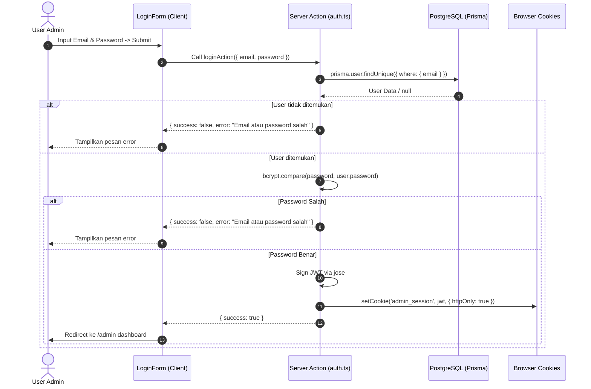

# Implementation Plan — Server Action Login Form

Rencana ini mengatur implementasi **Server Action** untuk autentikasi login (`loginAction`) di portal Admin **Smktibazmav3**, menghubungkan form login UI (`components/login-form.tsx`) dengan database PostgreSQL via Prisma dan sistem session HTTP-only cookie.

---

## Technical Standards & Requirements (Sesuai `AGENTS.md`)
- **Server Actions**: Menempatkan logika autentikasi backend di `app/actions/auth.ts` menggunakan directive `'use server'`.
- **Standard Response Format**:
  ```typescript
  export type ActionResult<T = unknown> = {
    success: boolean;
    data?: T;
    error?: string;
  };
  ```
- **Password Security**: Menggunakan library **`bcryptjs`** untuk verifikasi *password hash* secara aman.
- **Session & Cookies**: Menggunakan **`jose`** untuk membuat JWT session token dan menyimpannya di browser via `cookies().set()` (`httpOnly`, `secure`, `sameSite: 'lax'`).
- **Input Validation**: Validasi data input (email/username & password) sebelum diproses ke database.

---

## User Review Required

> [!IMPORTANT]
> 1. **Library Hashing `bcryptjs`**: Perlu menambah paket `bcryptjs` dan `@types/bcryptjs`.
> 2. **Initial Admin Seed**: Menyiapkan fungsi helper/script untuk mendaftarkan user Admin pertama jika database masih kosong.
> 3. **Session Expiry**: Masa berlaku token session diatur default 1 hari (24 jam).

---

## Proposed Changes

### Dependencies

#### [MODIFY] [`package.json`](file:///c:/Users/Hp/OneDrive/Documents/bdeul/code/smktibazmav3/package.json)
- Menambahkan dependency `bcryptjs` dan `@types/bcryptjs`.

---

### Backend & Server Actions

#### [NEW] [`app/actions/auth.ts`](file:///c:/Users/Hp/OneDrive/Documents/bdeul/code/smktibazmav3/app/actions/auth.ts)
- Menyediakan fungsi backend Server Action:
  1. `loginAction(prevState, formData)` / `loginAction(input)`:
     - Memeriksa kelengkapan `email` dan `password`.
     - Mencari user berdasarkan email di database (`prisma.user.findUnique`).
     - Membandingkan password menggunakan `bcrypt.compare(password, user.password)`.
     - Jika valid, generate JWT payload `{ userId: user.id, email: user.email, name: user.name }` menggunakan `jose.SignJWT`.
     - Menyimpan JWT di HTTP-only cookie `admin_session`.
     - Mengembalikan `{ success: true }`.
  2. `logoutAction()`:
     - Menghapus cookie `admin_session` dan merevalidate rute `/admin`.
  3. `createInitialAdmin()` (Helper):
     - Membuat akun admin default jika belum ada user terdaftar di database.

---

### Client Component

#### [MODIFY] [`components/login-form.tsx`](file:///c:/Users/Hp/OneDrive/Documents/bdeul/code/smktibazmav3/components/login-form.tsx)
- Menghubungkan form dengan `loginAction`:
  - Mengelola state `error` (pesan kesalahan dari Server Action).
  - Mengelola state `isLoading` saat mutasi berlangsung.
  - Jika sukses, melakukan pengalihan rute ke `/admin` (`router.push('/admin')` / `window.location.href = '/admin'`).

---

## Data Flow Diagram



---

## Verification Plan

### Automated / Command Verification
1. Install dependency `bcryptjs`:
   ```powershell
   npm install bcryptjs
   npm install -D @types/bcryptjs
   ```
2. Uji TypeScript linting:
   ```powershell
   powershell -ExecutionPolicy Bypass -Command "npx tsc --noEmit"
   ```

### Manual Verification
1. **Login dengan Kredensial Salah**: Masukkan email/password yang tidak ada di DB -> Harap tampil pesan error *"Email atau password salah"*.
2. **Login dengan Kredensial Benar**: Masukkan email & password yang valid -> Cookie `admin_session` terbuat secara otomatis dan ter-redirect ke dashboard `/admin`.
3. **Pemeriksaan Cookie**: Buka DevTools (F12) -> Application -> Cookies -> Pastikan cookie `admin_session` bertipe `HTTPOnly`.
